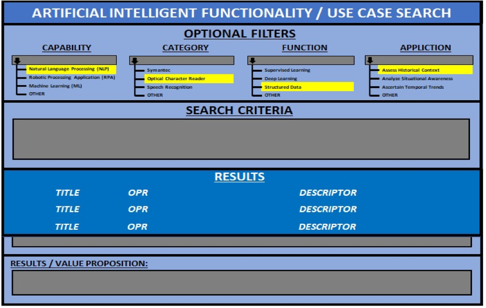

## Appendix A – AI Functionality Template

As ascribed in this Playbook, leveraging the AI capabilities to solve the most perplexing problems and challenges capitalizes on the operational benefits that this technology can provide.  The following is a template that can be used to identify the multitude of means to utilize AI.  This is designed to register the use cases so that others can appreciate the various ways of applying AI technology. It serves as a card catalog upon which to search functionality, capabilities, and application of the creative use of AI.

**Use case template/questionnaire:**

- What question(s) do you believe AI can help you solve?
- Tell us about your data. Are they very well structured? Well-structured data would be driver’s license records at a DMV, poorly structured data would be if you Googled “cat.” This goes to the heart of the question about how much data you need. With well-structured data, you need less. With poorly structured data, you need a lot. The internet has lots and lots of pictures of cats, for example, so poorly structured data in this case.
- How does your data move from point of acquisition (point A) to the place where they are deposited (point B)? Are all your datasets in one place?
- What infrastructure/software components/people are required to get data from A to B?
- Have you examined possible sources of bias?
- Has your organization adapted well to the AI deployment?
- Did AI help you solve your problem? Why or why not?
