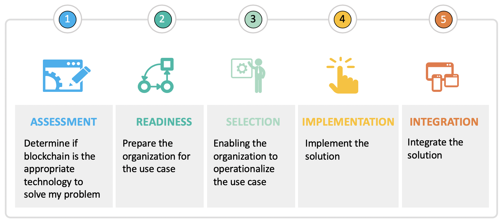
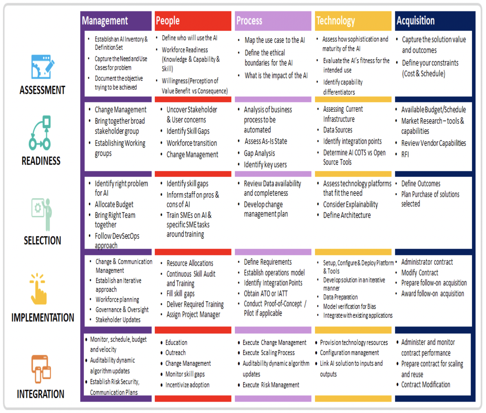

As noted in the ACT-IAC Artificial Intelligence/Machine Learning Primer , artificial intelligence may be applied to help government reduce fraud, errors, and cost of paper-intensive processes, while enabling collaboration across multiple divisions and agencies to provide more efficient and effective services to citizens. The adoption of AI may enable government agencies to provide new value-added services and serve as a catalyst to modernize IT. How can agencies turn that potential into reality?

- **Understand the technology using the AI Primer:** Over a dozen federal agencies and a variety of industry partners collaborated to develop the ACT-IAC Artificial Intelligence/Machine Learning Primer which provides government with an introduction to AI, outlines its related technologies, and presents several potential use cases.

- **Incorporate AI functionality using the AI Playbook:** The ACT-IAC Artificial Intelligence Working Group developed this playbook to guide government in taking the appropriate steps and developing the necessary plans to appropriately implement this technology to achieve the goals of their specific missions.

- **AI and data-centered organizations:**  AI has the potential to significantly impact both business processes as well as provide the foundational capabilities to achieve the objectives that fulfill the goals of the organization.

This playbook applies the concepts of the ACT-IAC playbook framework (Appendix B) as well as the General Services Administration’s Modernization and Migration Management (M3)  unified shared services framework to help government achieve successful outcomes and reduce risk during an AI deployment. The progression of this framework ensures the application of the appropriate models to optimize available resources in order to deliver the most effective solution.

By leveraging this playbook during each iteration of AI implementation, organizations can understand the actions necessary to deliver minimally viable product (MVP), proof of concept (POC), pilot/limited fielding, initial operational capability (IOC), and a fully operational system to support their overarching objectives.  Not all topics in each phase may apply to all iterations. However, this playbook should remain useful as a step by step process to deliver solutions and provide a scalable product that is sustainable through the lifecycle of development, implementation, and recapitalization.

It is also important to note that at scale and fully implemented, AI technology will probably require several solutions and provide an evolutionary catalyst to solve and support the evolutions and transformation of the entire organization.  Therefore, it is important that at the onset, any organization interested in leveraging AI will need to define the appropriate stakeholders and the group (network peers) that will participate in the steps outlined in the playbook. It serves as a catalyst to the necessary cultural transformation at the core of change management essential for the evolutions of today’s organizations.

As government efforts move through implementation of this new and rapidly developing technology, contributions to this playbook (e.g., additional best practices, lessons learned, and feedback) are welcome to keep this resource current, comprehensive, and effective in meeting the needs of government.

_Figure 1: ACT-IAC AI playbook phases - [expand](../assets/img/playbook/pb-process.png){:target="_blank"}_

**Phase 1 - Problem Assessment:**  Develop a vision and business objectives through various assessments to ensure the AI solution addresses a specific use case and delivers results that optimize services and operational delivery.

**Phase 2 - Organizational Readiness:**  Engage AI subject matter experts and consider the nuances that accompany an AI solution to prepare the organization. This includes creating a project management office, as well as the establishment of AI-tailored business, functional and technical requirements, and implementation plans.

**Phase 3 – Solution Selection:**  Conduct a thorough investigation of business consideration, types of AI requirements, deployment models, and procurement options to enable optimal provider selection to achieve the desired end state.

**Phase 4 - AI Implementation:**  Customize and configure AI solution to meet the organization’s operational objectives.

**Phase 5 - AI Integration:**  Integrate AI solution into the organization’s infrastructure.

_Figure 2: AI playbook phases and key activities matrix - [expand](../assets/img/playbook/pb-keyactivities.png){:target="_blank"}_

[Next](/ai-playbook/phases/1/){: .usa-button }