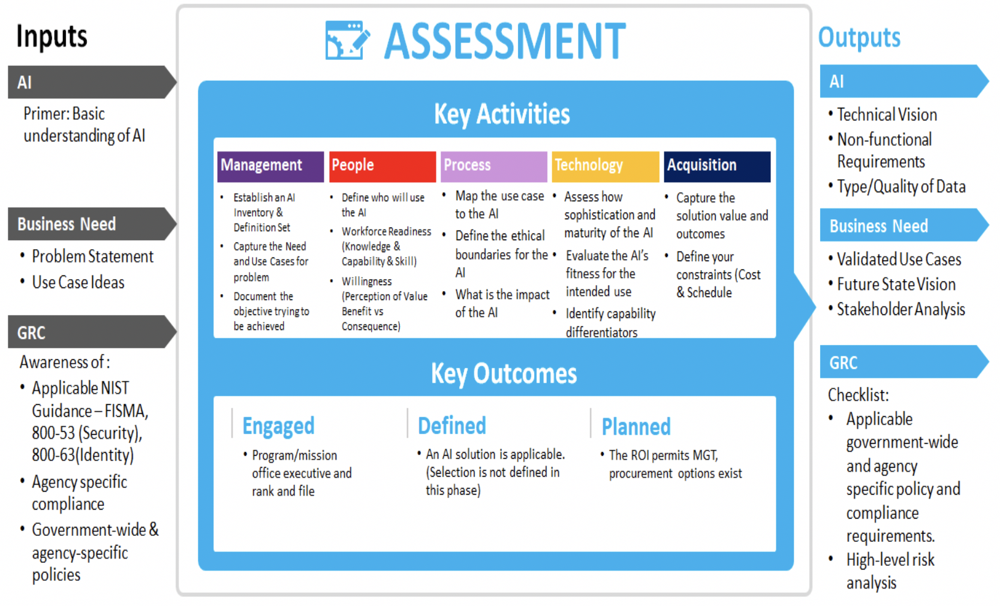

## Phase 1 - Problem Assessment

The first phase is designed to help decision makers create the most value through their AI initiative. It includes tools to ensure that the initiative is designed to address a specific use case and advancing mission goals, even if that is not an AI solution. Inputs and outputs artifacts are organized in 3 categories - AI, Business Need and Governance Risk & Compliance (GRC).

### Phase Inputs

_Figure 3: assessment phase (1) summary - [expand](../../assets/img/playbook/pb-phase1.png){:target="_blank"}_

### Key Goals

- Determine if AI is the appropriate technology solution.
- Reassess outcomes of later playbook stages to validate and ensure that the AI solution is still the best option to fulfill the goals and objectives of the organization.
- Develop future reassessment questions.

### Key Participants

- Business Sponsor/Advocates/Executives/Strategists/Program Manager/Stakeholders
- Technologist/Enterprise Architects/Computer Engineers/Security and Risk Managers
- Functional Data Stewards/Architects/Scientist/Visualizers/Subject Matter Experts (SME)
- AI Technology SME/Product Manager/Programmer/Integrator

### “Do I need a blockchain?”

The following are key assessment questions to consider as a preliminary guide for those considering an AI approach. Afterwards, determine your total score to gain insight into the possibility for a substantial Return on Operations (ROO-increased effectiveness) and Return on Investment (ROI-increased efficiency) from the development (integration) and application (implementation) of the proposed AI approach.

**Note:** This is a notional table and the level of importance associated with each question may be tied to the use case being assessed. Assign Points based on the Attribute Importance Rank (with suggested weighting). You may adjust the weight of questions as they apply to your use case. (5 – critical, 4 – very high, 3 – high, 2 – moderate, 1 – slightly, 0 – not at all)

<form lpformnum="1">
    

    
    
        <ol>
            
            <li>
                <b>{{quest.question-title}}</b> {{quest.question-description}}
                 
                <fieldset class="usa-fieldset-inputs usa-offset-one-twelfth">    
                    <ol class="usa-unstyled-list">
                        
                        <li class="answer">
                            <input id="{{ rb.id }}" type="radio" onclick="updateResult()" name="{{ quest.question }}" value="{{rb.value}}"  checked >
                            <label for="{{ rb.id }}">{{ rb.label }}</label>
                        </li>
                        
                    </ol>
                </fieldset>
            </li>
            
        </ol>
    

<h3> Questionnaire Results </h3>
The total score will serve as a preliminary assessment for those considering an AI approach. While useful, this is still only a guide for consideration and further investigation. Thorough engineering analysis and practices should still prevail.

<b>Assessing your Score:</b> In order to assess the applicability of an AI approach, the total score will guide the reader whether an AI approach would be beneficial (high score) and where it is less likely (may still be applicable but needs additional scrutiny).

    <h3 id="total">Total: xx points</h3>
    

        The total score will serve as a preliminary assessment for those considering an AI approach. While useful, this is still only a guide for consideration and further investigation. Thorough engineering analysis and practices should still prevail. 
        <b>Assessing your Score:</b> In order to assess the applicability of an AI approach, the total score will guide the reader whether an AI approach would be beneficial (high score) and where it is less likely (may still be applicable but needs additional scrutiny).
    

    <h4 id="grouping--20-18-total-points" style="">Score (-20 - 18 total points)</h4>
    
A score of 18 or below typically represents a small ROO/ROI and limited applicability from an AI approach. Consider that while the score may be low, your situation may still warrant deeper analysis as there can be a compelling reason to continue with an AI approach that did not fall into the standard categorization. 

    <h4 id="grouping-19-40-total-points" style="">Score (19 - 40 total points)</h4>
    
A score of between 19 and 40 could typically be supported with an AI approach but is not an overwhelming natural candidate. These situations can have powerful reasons that can still drive an AI approach, yet they might also have mitigating factors that make a traditional approach a better alternative.  In these situations, a more thorough analysis is typically needed.

    <h4 id="grouping-41-50-total-points" style="">Score (41 - 50 total points)</h4>
    
A score above 41 typically represents a compelling ROO/ROI and strong applicability that would benefit significantly from an AI approach. It is strongly recommended to consider the costs and benefits of an AI approach in these instances while still considering other additive and mitigating factors in the organization, strategic direction, interdependencies, and related items.

</form>

### Key Considerations

With the word AI being used everywhere, it is important to separate reality from hype when it comes to which uses cases can actually benefit from an AI solution. Consider the following advice and best practices when evaluating AI for any use case.  

**Demonstration of Capabilities/Minimal Viable Product (MVP):**

Set goals and objectives for each AI use case by defining a schedule for the MVP/POC demo.

- Establish a high-level framework to prioritize the use cases based on the assessment questions:  
  - Data availability/completeness
  - Business value/outcome
  - AI technology maturity
  - Compliance assessment (legal, regulatory, etc.)
- Confirm exploration of the use case scope against the knowledge repository of the organization for re-use or lessons learned to benefit from any previous application of the AI.

**Set Your Foundation:**

- Introduce incentives to encourage workforce innovations to spark use cases partnerships across functions.
- Create governance objectives that empower vs restrict use case exploration.

**Business Capabilities and AI Capabilities:**

- Consider mapping your business capabilities to your AI capabilities.
- Publish a list of existing capabilities across the organization.
- Create blueprints that maximize usage of their existing capabilities.

**Build AI Architectural Blueprint for Future Phases:**

Develop a vision and a plan for the additional requirements and challenges that will need to be addressed if your solution moves into a prototype phase and subsequent operational pilot phases. This should encompass modernization and integration with legacy systems in consideration of infrastructure requirements to host AI applications. Currently FedRAMP Authority to Operate (ATO) accreditation of the AI application is a viable option .  Additional options should include the necessary activities essential for major change management components.  The viability of these opportunities should take into account policy, process, operational, and cultural requirements.

**Building or Taking an Inventory:**

Current algorithms, dashboards, questionnaire/checklist objectives statements, and computer macros across an organization can be used as the basis to understand how AI might map to business processes.

**Build Once, Use Many:**

- Leverage innovative partnerships with focused or niche domain players that can contextualize exploration of use cases and accelerate MVP/prototypes.
- Use mature tools that can integrate with existing technology stacks to minimize your technology debt.
- Focus on the use case ability to exploit or maximize the value proposition/ROI.

Ultimately, the organization should examine the desired technologies and subsequent capabilities that can be enabled by the future state AI solution. Building a working blueprint of the technical architecture presents a powerful tool for defining the scope and phases of a comprehensive AI implementation. Strategic scaling will enable organizations to optimally address pain points and align stakeholders while tackling one priority area at a time.  This will ultimately accomplish the transformational objectives that advance mission goals.

**Emphasize ROI and Benefits:**

Emphasize ROO/ROI while making an assessment. Examine the solution's common costs/ benefits to provide increased effectiveness and deliver more efficiencies from their AI solution. Include design thinking based on personas and a prioritization matrix around value versus complexity.  A MVP should prove viability of an AI solution with ROO/ROI measures to ascertain potential operational gains and resource savings in effectiveness and efficiencies respectively. Also important to consider is the reduction of risk in their ability to meet their mission goals. Ultimately, the ROO/ROI considerations should include:

- Gains in effectiveness of productivity – Effort and cost currently utilized on reconciliation to determine the impact on ROO provided by an AI solution, when exchanging data or assets.
- Gains in efficiency and cost savings – Effort and cost it currently takes on reconciliation to determine the ROI provided by an AI solution, when exchanging data or assets.
- Incremental gains – Implementation in small increments, keeping to a true agile methodology. This is not a lift and replace but a gradual shift to a strategically-assured, positive ROO/ROI.
- Cloud first and shared services – Provides for an agile service delivery model which is more adaptive in nature with low entry cost and more consistent delivery of productivity over time.
- User experience – Seamless interface and ease of use by users to derive the benefits of the AI experience.
- Reducing risk – Understand the ROO/ROI that AI can provide as a result of the reduction in risk.

**Incorporate Regulations/Mandates:**

AI has the potential to traverse large swaths of data and generate new forms of data aggregation requiring impact assessments against standards such as National Institute of Standards and Technology (NIST)  along with other legal and regulatory considerations (GDPR , HIPAA , Personally Identifiable Information, Data Sensitivity). Organizations should review the use case to understand the application of standards around use of AI and develop risk management plans around underlying technologies that support the use case as it relates to the ethics, mission goals, and business objectives. As organizations seek to establish levels of governance and enforce assessment standards that drive new outcomes, the goals and objectives achieved by the AI use cases should be reviewed at each phase and iteration to assure existing regulatory, legislative, and policy guidance surrounding the use cases are being fulfilled.

### Key Activities

#### Management

- Establish an AI inventory and definition set for your organization:
  - Engage executive sponsor and key stakeholders from different functional domains (missions/business, finance, HR, IT, etc.) and explore use cases within each domain.
  - Organizations may be at different levels of maturity with regards to their use of AI. It is important to know what capabilities may already exist within the organization and ensure an established inventory of AI technologies and common use cases has been captured to provide a baseline and perspective for the assessment of AI and its applicability for a specified use case.
  - For early adopters of AI who may be uncertain of its applicability for a specific use case, the Primer can help organizations ensure there is a common understanding of the appropriate AI terminology, frameworks, models, and lexicon so that attributes of AI’s components can be deconstructed and assessed as part of the use case alignment.
  - By establishing a common AI inventory and standardized definition set for the organization, the reusability of assessments for use cases can offer an enhanced benefit in helping agencies revisit and accelerate their assessment and progress through later stages of the playbook.

- Capture the needs and the use cases of the problem statement:
  - Establish preliminary priorities of use cases based on benefit, data/technology readiness, etc.
  - AI offers a wide variety of opportunities to solve organizational problems and answer important questions with predictive and qualitative elements using cross functional structured and unstructured data elements.

#### People

- Define who will use AI:
  - The adoption of emerging technologies generate a ripple effect in the organization.  Identifying individuals and user groups impacted in the creation, operation, maintenance, and benefit from an AI solution shape the stakeholder landscape.
  - Identification of users, stakeholders, and populations affected should follow an established practice and protocol, so that categorization and identification can be reliably replicated for multiple problems as candidates for an AI solution.
  - For the specific candidates for an AI solution, defining the necessary functions with the help of subject matter experts, process owners, and support organization will identify the stakeholders essential to coordinate and collaborate the implementation of the AI solution.

- Workforce readiness (knowledge/capabilities/skills):
  - Successful adoption of an AI solution ultimately depends on the workforce integrating the advanced technology into established business processes.  A comprehensive strategic communication plan is essential to creating a collaborative partnership essential to taking advantages of AI capabilities. 
  - Ensuring a catalogue of available training for the workforce to include options for the skills and capabilities inherent in the AI-driven solution such as establishing a Learning Management System (LMS) that can track and report participation in the coursework to optimize the propensity for knowledge transfer.

- Willingness (perception of value benefit versus consequence):
  - The executive level awareness and endorsement of technology is an efficient and effective way to enhance the agency mission and increase the impact of resource investments.
  - Assessment of the critical success factors and lessons learned from prior efforts in adopting technology, as well as the tolerance for changes in established business processes, are predictive tools for the willingness to adopt AI as a viable solution.

#### Process

- Map the use case milestones to AI implementation:
  - Align the use case objectives by taking into consideration the underlying business processes tied to specific outcomes (the Primer outlines viable AI solutions that can be incorporated).
  - Remain focused on the problem to be solved, mindful of the available options and resulting opportunities of AI capabilities that can deliver solutions (leverage the frameworks and models of this playbook to monitor and manage progress).

- Define the ethical boundaries for AI: Assessing the viability of AI as a potential solution set for the defined problem includes identifying the risk of cognitive, cultural, and computational bias of AI as it pertains to data, algorithms, and aggregation to ensure outcomes are in compliance with ethical considerations:
  - Safeguarding the personal nature of data – identity risk points where the solution intersects with Personally Identifiable Information (PII), either in the defined outcomes or data sets.
  - Autonomous systems parametric framework – identify risk points for the spillover of AI into the larger enterprise architecture through association of data sets and user populations from the use case.
  - Cultural and cognitive bias – identify risk points for unconscious bias embedded in the data sets, the problem statement, or the business process to drive and deliver pre-determined outcomes.

- Impact of AI on the organization:
  - The ability of the enterprise to accommodate a change in respect to advanced technologies is a key factor in assessing the impact of AI on the technology architecture of the organization.
  - The integration impact of AI on the workforce, not only in skills and competencies but also on morale and continuity of mission, has to be included in the assessment of the viability for the adoption of AI.

#### Technology

- Assess the sophistication and maturity of AI. Technology should comply with enterprise architecture principles.
- Evaluate the AI solution for its intended use:
  - Using the Primer as a guide for defined AI and their expected results
  - Assess the alignment of the desired outcomes for the resolution of the defined problem statement to ensure the fitness of AI capabilities for the prescribed solution
- Identify the capability distinctions, differences, and differentiators of the available AI solutions.

#### Acquisition

- Capture solution metrics (value and outcomes):
  - Produce desired value propositions to help the organization respond with viable, sustainable, and effective options that capitalize on opportunities to solve current problems.
  - Compare to current and past use cases to ascertain the available options to procure capabilities.

- Define your constraints (cost and schedule):
  - Acquisition can look to determine what is available within the agency’s own contracted services.  
  - Explore existing contract vehicles can reveal others within the organization that are utilizing AI capabilities.
  - Identify current and past AI services through Shared Management Offices  can determine “Best in Class” contract vehicles (OMB M-19-13 ).

### Key Outcomes

Engaged
At the executive level, integration of AI use case is endorsed to facilitate the overarching potential to fulfill the strategic intent.

At the program/mission office, confidence that AI integration is possible and that an AI solution will enhance the outcomes of business processes and meet all ethical requirements.
In the general workforce, acceptance of AI capabilities, preparation for future skills, and competency development to achieve the desired outcomes.

Defined
Careful consideration of the problem statement, in the context of the underlying business processes, will afford the means to appropriately apply existing technology within the environment that assures AI solution are appropriately applied. 

### Phase Outputs

The following artifacts generated during the Assessment Phase support the Organizational Readiness and the subsequent phases.

**Business Need**

- Capture the stakeholder vision of the desired operational end-state.
- Identify the deliverables necessary to achieve the ascribed goals.
- Document the use case 4P’s:  
- Problem: What is the negative impact of the current system?
- Process: What are the steps that created the problem?
- Potential: What are the preferred outcomes or alternative end-state?
- Proposal: What solutions are available to resolve the problem?
- Outline the necessary support that must be leveraged during the Readiness Phase.

**AI**

- Technical vision: Examination of the agency infrastructure, as well as options for external and shared services used in assessing the viability of the AI solution which informs the platforms and infrastructure readiness activities
- Non-functional requirements: Identification of associated data sets, underlying business processes, and workforce capability that are essential in the adoption of AI capabilities and their associated boundaries and readiness assessment activities

**Business Need**

- Valid Use Case: Identification and validation of the use case against the defined problem set narrows the readiness assessment activities vital to supporting a successful resolution of the problem.
- Future state vision:  Defining the value proposition and anticipated return on operations/ investment that provides the framework upon which serves as a baseline for readiness and future adoption phases.
- Stakeholder analysis:  Through identifying the impact of AI in the organization, as aligned to the internal and external stakeholders, and capturing expectations and reservations, the assessment phase provides the framework for stakeholder engagement and communication throughout the AI adoption lifecycle.

### Decision Gate

Consider the score on the “Do I need an AI” assessment questionnaire as a guide to proceeding with an AI approach.

- If the score is 41 and above, highly recommended to commence the Organizational Readiness review.
- If the score is between 19 and 40, recommended to commence the Organizational Readiness review. 
- If the score is between 5 and 18, recommended further review of the scope, the inputs and the assigned weights before determining if the proof of concept is applicable for AI prior to continuing readiness review.
- If the score is 5 or below, recommended the proof of concept is not appropriate for AI.

[Next](/ai-playbook/phases/2/){: .usa-button  }