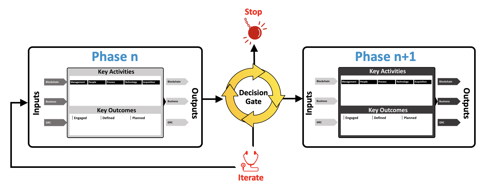

welcome to the AI playbook. In this section, you’ll find valuable information to help you understand the framework laid out in this document and a series of questions to guide you in the playbook and help you kick start your AI development journey.

## Framework Flow

The playbook introduces a framework made out of several phases connected to one another sequentially to guide you through key activities that will help you leverage AI technologies to tackle your use case.
Each phase is connected to a decision gate before automatically going to the next phase. This decision gate helps you determine if you should:

- **Go to the next phase –** using the outputs generated by the phase n, you determine that there is enough value to keep going to the next phase.
- **Stop –** using the outputs generated by the phase n, you determine that AI doesn’t bring enough value at this time.
- **Iterate –** using the outputs generated by the phase n, you determine that more work is needed or data from previous phases need to be adjusted.

_Figure 1: AI playbook process phase flow - [expand](../assets/img/playbook/pb-phase-flow.png){:target="_blank"}_

## Playbook Navigation

In addition, each phase is made up of key activities and outcomes whose purpose is to help you work through aspects needed to achieve your use case objectives leveraging AI technologies. The phase has inputs necessary for the key activities and generated outputs that will be needed for the decision gate. These outputs will also be used as inputs for the next phase.

### Where do I start?

The introduction contains graphics that represent the overall process to help organizations implement and integrate artificial intelligence (AI) solutions. Each phase of the process contains a more detailed graphic that summarizes the objective of the phase, its key activities and outcomes, inputs, and outputs. It provides a preview and a good starting point for each phase.

### I am a senior executive, what should I focus on?

Each playbook phase is composed of phase inputs, phase outputs, key activities and outcomes, and a decision gate. It is recommended that you read the introduction, the summation of each of the five phases, and the conclusion.  The inputs/outputs of each phase as well as the phase decision gate are useful in understanding the functionality of AI capabilities.  

### I am on the management team, what should I focus on?

As part of the management team, you need to understand the overall process. The diagrams are a good start. You should also focus on the “management” key activity category of each phase.  You can also look at the “management” key activity category of each phase to get an understanding of the role of the management team. 

### I am a data architect, scientist, and develop AI algorithms, how should I read this playbook?

This playbook is written from a top down perspective.  The first provides the strategic goals and drills down through the operational objectives and tactical requirements.  

### I am on the acquisition team, what should I focus on?

Each phase has an “acquisition” key activities category. There is also an acquisition section starting on page 60.

### I am on the development team, what should I focus on?

You should have a good understanding of the inputs needed to implement the technical solution. Focus on the “technology” key activities category of each phase.

### What is AI?

The ACT-IAC Artificial Intelligence/Machine Learning Primer1 provides the definition of AI, limitations, risk, ethical considerations, and the impact it can have to organizations.

### What about my workforce?

Each playbook phase has a set of key activities that are grouped in high level categories. The category labeled “People” highlights key activities regarding the workforce. Also, the Readiness Phase handles organizational readiness.

### What phase(s) should I follow for a proof of concept?

All the phases should be used to produce a proof of concept with only the most valuable functions of the use case developed.

### Can I use the playbook in an agile manner?

This playbook is intended to be used in an iterative way. One can go through the playbook phases multiple times to develop proofs of concept, pilots, and full implementation. Each iteration will dive deeper in the activities of each phase. Iterations can also occur to refine data in each phase and adapt the roadmap.

### How do I handle a use case with multiple organizations?

Each phase deals more or less with understanding the organization(s) undergoing the implementation of the solution. If you know more than one organization will be involved, when you look at the organizational aspects of the solution, address from the start the need for a multi-organization solution

[Next](/ai-playbook/intro/){: .usa-button }
